# laravel7チュートリアル

- 作成日：2019/01/23

- 更新日：2020/06/23

- 実行環境：aws cloud9

- 実行OS：ubuntu 18.04 LTS

- PHPバージョン：7.4.7

- Laravelバージョン：7.16.1


## はじめに

- 本記事では，PHPのフレームワークであるlaravelを用いてtodoアプリケーションを実装しながら，基礎的なlaravelの仕組みを学ぶ．todoリストの大まかな仕様は以下の通り．

  - タスク名・締め切り・コメントの3つを入力し，dbにデータを保存する．
  - メイン画面ではタスクの一覧を表示し，更新ボタンと削除ボタンを設置．
  - 更新ボタンクリックで更新画面へ移動し，データを更新することができる．
  - 削除ボタンをクリックすると，該当するデータを削除することができる．

## フレームワークとは

- フレームワークとは，はじめからよく使用される処理，関数，クラスなどが用意された枠組みのこと．
- フレームワークを使用しない場合（例：PHPで0から書き進める場合），実際にプログラムを書く人によって書き方が異なる．（1ファイルに多く記述，関数型，オブジェクト指向，など）
- その場合，複数人のチームで開発を行う際に規則性がないコードが生産されてしまう原因となる．
- フレームワークを使用すれば，はじめから規則性が決まっており，書き方さえ把握していれば誰でも規則に沿ったコードを書けるようになる．

### メリット

- 実装の負荷軽減．
- 保守性，セキュリティの担保．
- 規則性のあるコード．
- 可読性の担保．

### デメリット

- 学習コスト．
- 環境構築の手間．
- 言語への習熟度に影響される．

## Laravelの特徴

### 学習コストの低さ

- コードが読みやすく，記述量が少ない．
- 入力チェック，ログイン機能，ページネーションなどのwebサービスでよく使用される機能の実装が簡単．
- 本番環境へのアップロードが他のフレームワークと比較して容易．

## MVCフレームワークとは

- フレームワークにおいて，よく使われるシステム．
- 「Model」「View」「Controller」で構成される．
- この3つがそれぞれ異なる役割を担う「役割分担」のシステム．
- 初めて触れる場合，この役割を明確に理解することは困難．
- そのため，まずはMVCフレームワークで構成されたアプリケーションを実際に作成し，その後で知識を固めたほうが良い．

### Model/モデル

- webシステムの中で，データ処理を扱う部分．
- データベース操作である「登録」「表示」「更新」「削除」を行うのが主な役割となる．

### View/ビュー

- ブラウザでの表示領域を扱う部分．
- モデルやコントローラの処理を受け取り，ブラウザで表示するhtmlを出力することが役割．

### Controller/コントローラー

- モデルとビューの制御を行う部分．
- リクエストされたURLに応じて，処理を実行する．

###  Route/ルート

- アクセスされたURLに応じて処理を分類する部分．
- URLに応じて実行する関数を決める役割を持つ．

### ※LaravelとMVC

- 開発者のTaylor Otwell氏は「LaravelはMVCではない」と述べている．
- 確かにMVCの枠組みに近いが，Laravelは厳密に処理を記述する箇所が定められているわけではなく，柔軟に記述できる点も特徴である．


## 開発環境準備

- クラウド開発環境である「aws cloud9」を使用して開発を進める．
- ローカルの仮想サーバ（virtual box & vagrant）を用いて環境を準備する方法もあるが，やや手順が多くなるため今回はオンラインの環境を活用する．

### environment の準備

- environmentとはアプリケーションを管理するフォルダのようなもの．
- 1つのwebアプリケーションに対して，1つのenvironment，という理解でOK．

- awsのマネジメントコンソールから「cloud9」を探してアクセスする．

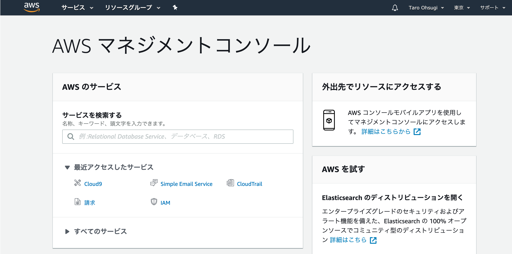

- 下記の画面になるので「create environment」をクリック．

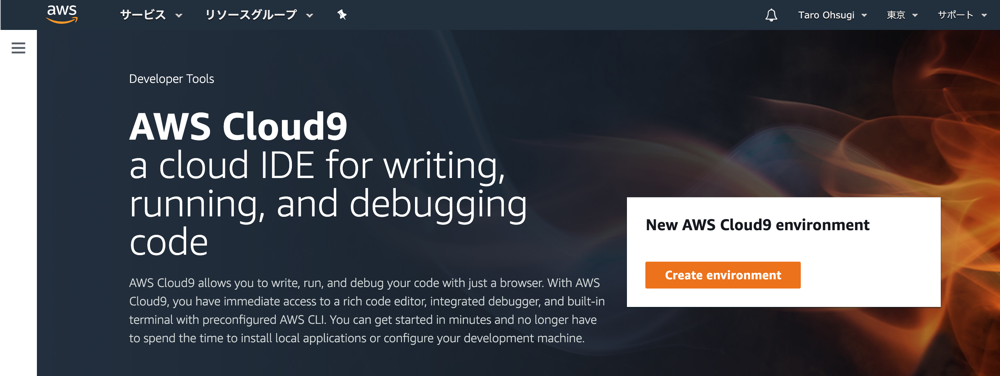

- 名前を適当に入力．（Descriptionは任意）

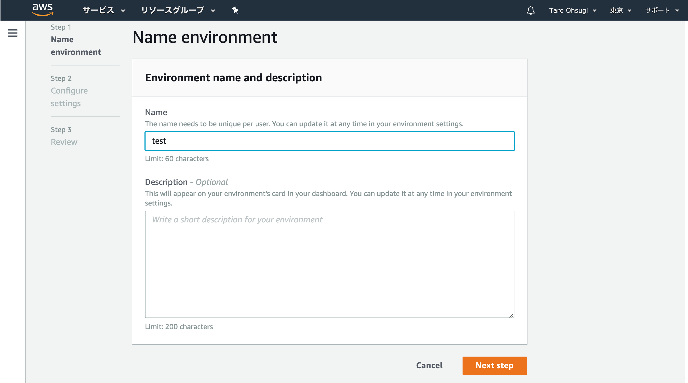

- 【重要】「Platform」は「`ubuntu server 18.04 LTS`」を選択．「Instance type」は「`t3.small (2 GiB RAM + 2 vCPU)`」を選択．その他はデフォルトで「create environment」をクリック．

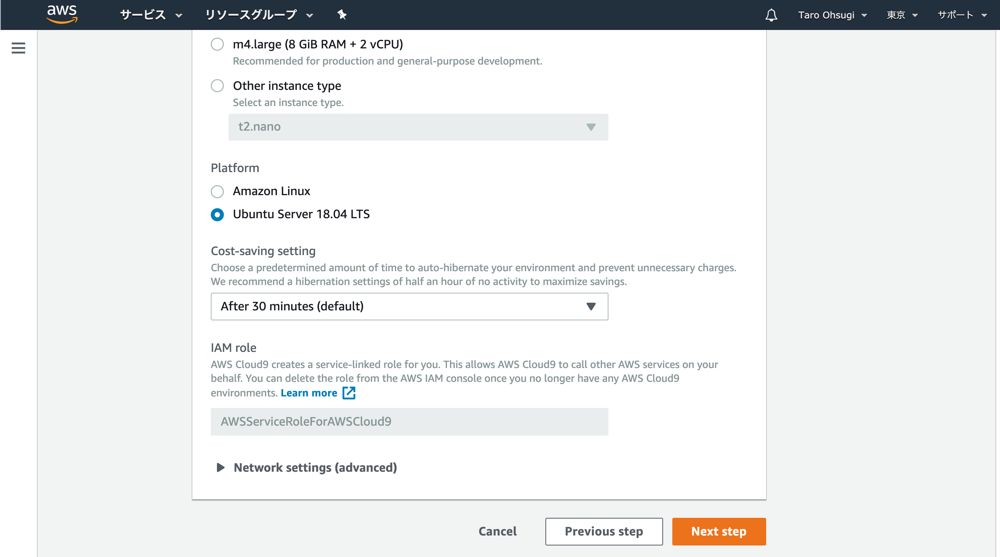

- 確認画面が出るので「next step」をクリック．

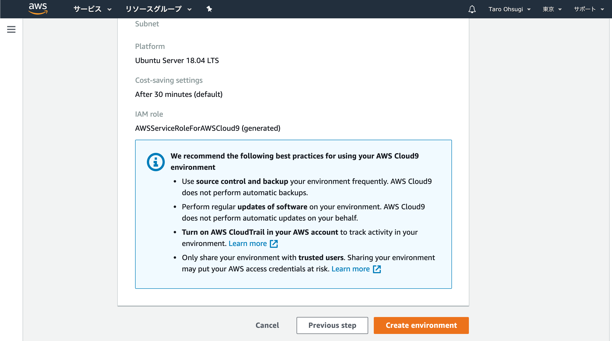

- しばらく待つと下記の画面が表示される．これで準備完了．

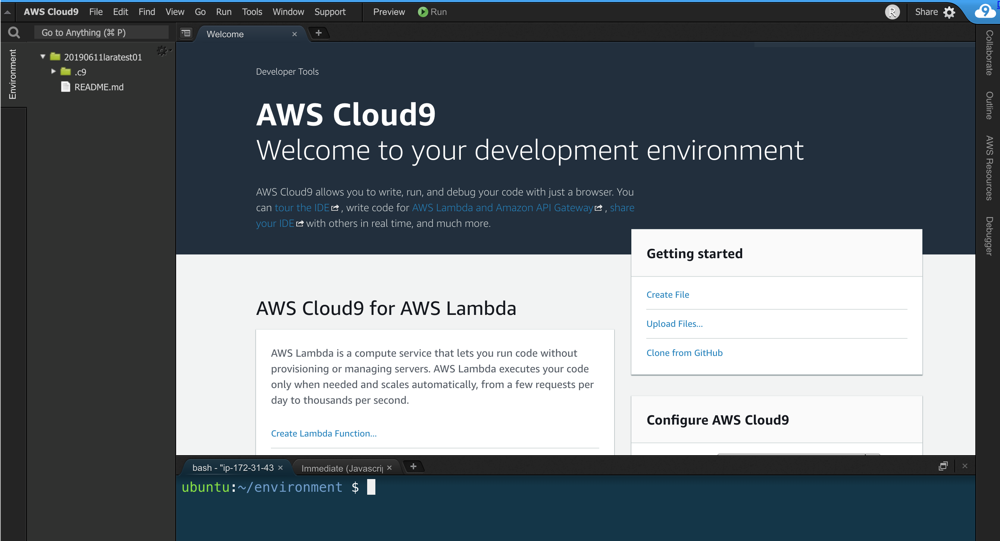


## Laravelのインストール

- PHP及びcomposerの状況を確認しつつ，Laravelのインストールを進める．
- 「compoesr」とはPHPライブラリのインストールやバージョン管理を行う便利ツール．

### PHPのバージョン確認

- インストールされているPHPのバージョンを確認する．
- ターミナルでバージョン確認のコマンドを実行する．

- 【注意点】（以降，ターミナルでの作業すべて）
  - $マークは入力しない．
  - 入力はすべて半角で行う．


- ターミナルで以下を実行

```bash
$ php -v
```

- 出力結果（バージョンは7.2.24）

```bash
PHP 7.2.24-0ubuntu0.18.04.3 (cli) (built: Feb 11 2020 15:55:52) ( NTS )
Copyright (c) 1997-2018 The PHP Group
Zend Engine v3.2.0, Copyright (c) 1998-2018 Zend Technologies
    with Zend OPcache v7.2.24-0ubuntu0.18.04.3, Copyright (c) 1999-2018, by Zend Technologies
    with Xdebug v2.6.0, Copyright (c) 2002-2018, by Derick Rethans
```


### composerのインストール

- composerはPHPのパッケージなどを管理する便利ツール．laravelのインストールに際して使用するため準備する．

- ターミナルで以下を実行．

```bash
$ curl -sS https://getcomposer.org/installer | php
```

- 実行結果
```bash
All settings correct for using Composer
Downloading...

Composer (version 1.10.7) successfully installed to: /home/ubuntu/environment/composer.phar
Use it: php composer.phar
```

- 続いて以下を実行．ダウンロードしたcomposerファイルを保存場所に移動させる．エラーが出なければOK．

```bash
$ sudo mv composer.phar /usr/bin/composer
```

- バージョンを確認する．

```bash
$ composer
```

- 実行結果（バージョンは1.9.3）

```bash
   ______
  / ____/___  ____ ___  ____  ____  ________  _____
 / /   / __ \/ __ `__ \/ __ \/ __ \/ ___/ _ \/ ___/
/ /___/ /_/ / / / / / / /_/ / /_/ (__  )  __/ /
\____/\____/_/ /_/ /_/ .___/\____/____/\___/_/
                    /_/
Composer version 1.10.7 2020-06-03 10:03:56

Usage:
  command [options] [arguments]
...
```


### PHPのバージョンアップ

- Laravelの最新バージョンでは「PHP7.2.5以上」が必要となる．
- とりあえず最新版にしておく．

- ターミナルで以下を実行．

```bash
$ sudo add-apt-repository ppa:ondrej/php
```

- 以下が出力されるがEnter押下で続行

```bash
Press [ENTER] to continue or ctrl-c to cancel adding it
```

- 実行結果

```bash
...
Hit:1 http://us-west-2.ec2.archive.ubuntu.com/ubuntu bionic InRelease
Hit:2 http://us-west-2.ec2.archive.ubuntu.com/ubuntu bionic-updates InRelease
Hit:3 http://us-west-2.ec2.archive.ubuntu.com/ubuntu bionic-backports InRelease
Hit:4 https://download.docker.com/linux/ubuntu bionic InRelease
Hit:5 http://security.ubuntu.com/ubuntu bionic-security InRelease
Get:6 http://ppa.launchpad.net/ondrej/php/ubuntu bionic InRelease [20.8 kB]
Get:7 http://ppa.launchpad.net/ondrej/php/ubuntu bionic/main amd64 Packages [52.1 kB]
Get:8 http://ppa.launchpad.net/ondrej/php/ubuntu bionic/main Translation-en [24.9 kB]
Fetched 97.8 kB in 2s (57.1 kB/s)
Reading package lists... Done
```

- 引き続き，以下を実行

```bash
$ sudo apt-get update
```

- 実行結果

```bash
Hit:1 http://us-west-2.ec2.archive.ubuntu.com/ubuntu bionic InRelease
Hit:2 http://us-west-2.ec2.archive.ubuntu.com/ubuntu bionic-updates InRelease
Hit:3 http://us-west-2.ec2.archive.ubuntu.com/ubuntu bionic-backports InRelease
Hit:4 https://download.docker.com/linux/ubuntu bionic InRelease
Hit:5 http://ppa.launchpad.net/ondrej/php/ubuntu bionic InRelease
Hit:6 http://security.ubuntu.com/ubuntu bionic-security InRelease
Reading package lists... Done
```

- 以下を実行

```bash
$ sudo apt-get install libapache2-mod-php7.4
```

- 途中で下記出力された場合はすべて「y」で続行

```bash
Do you want to continue? [Y/n]
```

- 実行結果

```bash
...
Creating config file /etc/php/7.4/apache2/php.ini with new version
libapache2-mod-php7.4: php7.2 module already enabled, not enabling PHP 7.4
Processing triggers for man-db (2.8.3-2ubuntu0.1) ...
Processing triggers for libc-bin (2.27-3ubuntu1) ...
Processing triggers for php7.4-cli (7.4.7-1+ubuntu18.04.1+deb.sury.org+1) ...
Processing triggers for libapache2-mod-php7.4 (7.4.7-1+ubuntu18.04.1+deb.sury.org+1) ...
```

- 以下を実行

```bash
$ sudo a2dismod php7.2
```

- 出力結果

```bash
Module php7.2 disabled.
To activate the new configuration, you need to run:
  systemctl restart apache2
```

- 以下を実行

```bash
$ sudo a2enmod php7.4
```

- 出力結果

```bash
Considering dependency mpm_prefork for php7.4:
Considering conflict mpm_event for mpm_prefork:
Considering conflict mpm_worker for mpm_prefork:
Module mpm_prefork already enabled
Considering conflict php5 for php7.4:
Enabling module php7.4.
To activate the new configuration, you need to run:
  systemctl restart apache2
```

- 以下を実行

```bash
$ sudo apt-get install php7.4-dom php7.4-mbstring php7.4-zip php7.4-mysql
```

- 途中で下記出力された場合はすべて「y」で続行

```bash
Do you want to continue? [Y/n]
```

- 実行結果

```bash
Creating config file /etc/php/7.4/mods-available/zip.ini with new version
Processing triggers for libapache2-mod-php7.4 (7.4.7-1+ubuntu18.04.1+deb.sury.org+1) ...
Processing triggers for libc-bin (2.27-3ubuntu1) ...
Processing triggers for php7.4-cli (7.4.7-1+ubuntu18.04.1+deb.sury.org+1) ...
```

- アップデート後のPHPバージョン確認

```bash
$ php -v
```

- 実行結果（バージョンは7.4.7）

```bash
PHP 7.4.7 (cli) (built: Jun 12 2020 07:44:05) ( NTS )
Copyright (c) The PHP Group
Zend Engine v3.4.0, Copyright (c) Zend Technologies
    with Zend OPcache v7.4.7, Copyright (c), by Zend Technologies
```

- ※ ここまでのコマンド操作でエラーが発生した場合は，「environmentの準備」からやり直すことをオススメ．下手にエラーを解決しようとするより，新しく作り直したほうが早い．


### Laravelインストーラの準備

- Laravelインストーラーは下記の場所に配置される．

```
/home/ubuntu/.composer/vender/laravel/installer
```

- 実際のインストールや必要なコードの配置は「composer」コマンドで実行するため,
設置場所に留意する必要はない．
- 「composer」は他に必要なライブラリなども合わせてダウンロードして配置を行う．「composer」を使用しない場合，すべて自分でダウンロードして設置場所の設定も行う必要がある．

- 以下を実行．

```bash
$ sudo composer global require "laravel/installer"
```

- 実行結果

```bash
...
symfony/polyfill-intl-idn suggests installing ext-intl (For best performance)
guzzlehttp/guzzle suggests installing psr/log (Required for using the Log middleware)
Writing lock file
Generating autoload files
13 packages you are using are looking for funding.
Use the `composer fund` command to find out more!
```

### Laravelプロジェクトの作成

- 実際にLaravelプロジェクトを作成する．
- インストールできる範囲で最新のLaravelがインストールされる．

- 以下を入力．（project01という名前でプロジェクトを作成する）

```bash
$ composer create-project laravel/laravel project01
```

- 実行結果

```bash
...
Package manifest generated successfully.
43 packages you are using are looking for funding.
Use the `composer fund` command to find out more!
> @php artisan key:generate --ansi
Application key set successfully.
```

- 以下でLaravelのバージョンを確認できる．

```bash
$ cd project01
$ php artisan --version
```

- 実行結果（バージョンは7.16.1）．実行時の最新版がインストールされる．

```bash
Laravel Framework 7.16.1
```

### 【参考】Laravelのバージョン指定

- 今回は最新版を使用してプロジェクトを作成しているが，バージョンを指定することもできる．

- 例えば，バージョン指定（5.8）する際にはプロジェクト作成時のコマンドを下記のように変更する．

```bash
$ composer create-project laravel/laravel project01 5.8.* --prefer-dist
```

- laravelでは公式ドキュメントにバージョンアップの項があるが，1つ前のバージョンからしか記述がない．

- そのため，基本的には最新バージョンのインストールがオススメである．


### Laravelのインストール確認

- Laravelインストールの確認にはwebブラウザで動作させて確認する．
- cloud9にはwebサーバが標準で搭載されているため，以下の手順で確認を行う．
- コマンド実行中は他のコマンドを打てないため，別タブで新しくターミナルを立ち上げておくと便利．

- 下記を実行．

```bash
$ php artisan serve --port=8080
```

- 実行結果

```bash
PHP 7.4.7 Development Server (http://127.0.0.1:8080) started
```

- 【重要】サーバーが動いた状態となるが，停止する場合は「`ctrl + c`」で停止できる．

- 下記手順で動作を確認．

  1. 上部の「preview」をクリック．
  2. 「prewiew running application」をクリック．
  3. 右下にプレビュー画面が表示される．
  4. プレビュー画面右上の「Browserの右側のボタン」をクリック．
  5. 新しいタブで下記画面が表示されればOK．

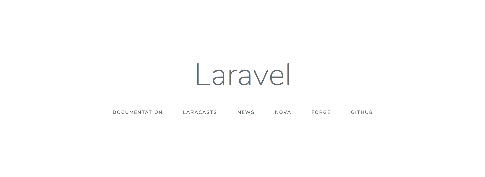


## 【参考】Laravelルートディレクトリのファイル構成

- 主なディレクトリ構成を解説する．次項で挙げる，よく使用するディレクトリを押さえれば当面はOK．

### app

- アプリケーションのコアコードを配置する．
- ModelやControllerもここに配置．
- 良く使用する．

### bootstrap

- フレームワークの初期起動やオートローディングなどの設定ファイルが含まれる．
- cache関連のファイルもここに保存される．
- 自分でファイルを作成する頻度は少なめ．

### config

- アプリケーションの設定ファイルが保存される．

### database

- データベースのマイグレーションファイルが保存される．
- コマンドを実行した結果，生成されたファイルを編集する場合が多い．

### public

- クライアントサイドのasset（css, javascriptなど）を配置する．
- ここがドキュメントルートとなる．

### resources

- Viewのファイルが保存される．
- ブラウザで実際に表示させたい画面を作成するイメージ．

### routes

- ルーティングを行うファイルを配置する．
- ファイル自体ははじめから用意されているので，必要な処理に応じて追記する．

### tests

- 自動テストを配置する．

### vendor

- composerでインストールしたパッケージが配置される．


## よく使用するディレクトリ&ファイル

### /.env

- 環境設定に使用

### /routes/web.php

- ルーティングに使用

### /resources/views/***

- Viewで使用するファイルを設定，保存

### /app/Http/controller/***

- Model, Controllerを設定，保存


## 0. アプリケーション作成の流れ

1. 必要なライブラリ等の準備
2. データベース&テーブルの設計，作成（マイグレーション）
3. モデルの作成（データ操作できる状態）
4. ルーティングとコントローラの作成
5. Viewの作成（表示する画面）
6. 登録処理の作成
7. 表示処理の作成
8. 削除処理の作成
9. 入力フォームと一覧画面の項目追加
10. 更新処理の作成
11. 認証処理の作成

## 1. 必要なライブラリの準備

- laravelではwebアプリケーションでよく使用されるライブラリが準備されているが，実際にインストール（とビルド）を行わないと使用できない．

- アプリケーション実装前に今回使用するライブラリを準備しておく．今回使用するものは以下．

  - laravel/ui（ライブラリのコア）
  - bootstrap（デザインを整えるのに使用）
  - auth（認証関連の処理で使用）

### 1.1 事前準備

**環境構築時に「Instance type」を「`t3.small (2 GiB RAM + 2 vCPU)`」で設定した場合は，本項は実施する必要がない．その場合は本項は実施せずに1.2項に進む．**

- まず，インストールするために必要なメモリ領域を増やしておく．これをやらないとメモリ不足でエラーになる場合があるため．

- メモリのサイズ自体は変更できないが，記憶領域の一部をメモリ用に割り当てることにより使用できるメモリ領域を増やしている（スワップ領域）．

- コマンドで以下を実行する．実行前に，ターミナルのカレントディレクトリが「project01」であることを確認しておくこと．

```bash
$ sudo dd if=/dev/zero of=/swapfile bs=1M count=1024
```

- 実行結果．少し時間がかかるので待つ．

```bash
1024+0 records in
1024+0 records out
1073741824 bytes (1.1 GB, 1.0 GiB) copied, 13.7428 s, 78.1 MB/s
```

- 以下を1行ずつ実行．

```bash
$ sudo chmod 600 /swapfile
$ sudo mkswap /swapfile
```

- 実行結果
```bash
Setting up swapspace version 1, size = 1024 MiB (1073737728 bytes)
no label, UUID=c60c6cdf-b4fc-4810-b9cf-58bd2f376e7a
```

- 以下を実行．

```bash
$ sudo swapon /swapfile
$ free --mega
```

- 実行結果（Swapの部分が1500くらいになっていればOK）

```bash
              total        used        free      shared  buff/cache   available
Mem:           1007         228          69           1         708         627
Swap:          1548         221        1326
```

### 1.2 ライブラリのインストール

- ようやくライブラリが準備できる．ディレクトリが`project01`でない場合は移動しておく．

```bash
$ cd project01
```

- 下記コマンドを実行する．

```bash
$ composer require laravel/ui
```

- 実行結果

```bash
...
Discovered Package: laravel/ui
Discovered Package: nesbot/carbon
Discovered Package: nunomaduro/collision
Package manifest generated successfully.
43 packages you are using are looking for funding.
Use the `composer fund` command to find out more!
```

- 続けて以下を実行．

```bash
$ php artisan ui bootstrap --auth
```

- 実行結果

```bash
Bootstrap scaffolding installed successfully.
Please run "npm install && npm run dev" to compile your fresh scaffolding.
Authentication scaffolding generated successfully.
```

- 以下を実行．やや時間がかかるので待つ．

```bash
$ npm install
```

- 実行結果

```bash
...
added 1110 packages from 499 contributors and audited 1113 packages in 23.01s

36 packages are looking for funding
  run `npm fund` for details

found 1 low severity vulnerability
  run `npm audit fix` to fix them, or `npm audit` for details
```

- ここまででライブラリのインストールは完了．

### 1.3 ファイルのビルド

- 次は実行に必要なファイルをビルドする．以下を実行．やや時間がかかるので待つ．

```bash
$ npm run dev
```

- 実行結果

```bash
...
98% after emitting SizeLimitsPlugin

 DONE  Compiled successfully in 8414ms                       2:39:53 AM

       Asset      Size   Chunks             Chunk Names
/css/app.css   178 KiB  /js/app  [emitted]  /js/app
  /js/app.js  1.07 MiB  /js/app  [emitted]  /js/app
```

### 1.4 swap領域の削除

**環境構築時に「Instance type」を「`t3.small (2 GiB RAM + 2 vCPU)`」で設定した場合は，本項は実施する必要がない．その場合は下記コマンドは実行せず，動作確認のみ行う．**

- 記憶領域から1GB借りてきているので元に戻す．

- 下記を実行．

```bash
$ sudo swapoff /swapfile
$ sudo rm /swapfile
```

- これで準備OK．ブラウザで表示を確認しておく．右上に「login」「register」が表示されていればOK．

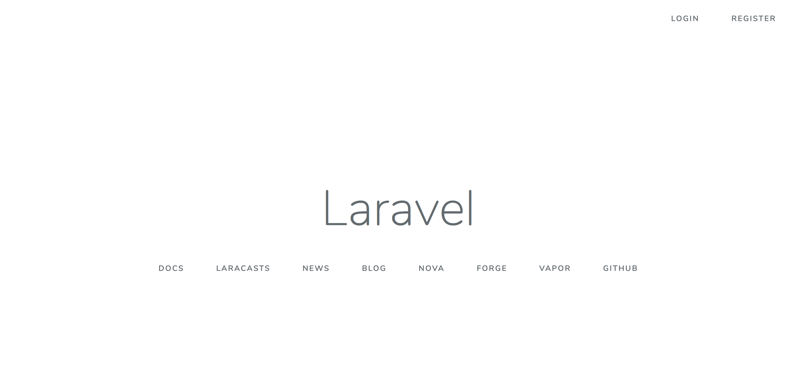

## 2. データベースの準備

### 2.1 データベースの設定

1. Laravelでは「`.env`」ファイルにデータベースの設定を記述する．project01ディレクトリ直下に配置されている．

2. 「`.env`」ファイルは隠しファイルなので，表示されていない場合は，ファイルツリー画面右上の歯車マークをクリックして「Show Hidden Files」にチェックを入れると表示される．

3. 「`.env`」ファイルをダブルクリックして開く．

4. ファイルの内容を以下のように編集する．

- `.env`ファイルの内容

```txt
DB_CONNECTION=mysql
DB_HOST=localhost   // 編集
DB_PORT=3306
DB_DATABASE=project01   // 編集
DB_USERNAME=root
DB_PASSWORD=root    // 編集
```

5. **サーバが立ち上がっている場合は**以下のコマンドを実行し，`.env`ファイルを読み込む．`.env`ファイルの内容はcacheに保存されているので，変更したらcacheを消去しないと変更内容が読み込まれない．サーバを再度立ち上げ直してもOK．

```bash
$ php artisan config:cache
```

- 実行結果

```bash
Configuration cache cleared!
Configuration cached successfully!
```

### 2.2 データベースの確認

- 記述したらDBの状態を確認する．ターミナルのカレントディレクトリが「project01」であることを確認する．ターミナルの「$」の前が「`/project01`」となっていればOK．

- 「`/project01`」でない場合はターミナルで以下を実行してディレクトリを移動する．

```bash
$ cd project01
```

- 続けて以下を入力し，mysqlを起動&ログインする．はじめは管理者権限でないとログインできない．

```bash
$ sudo mysql
```

- 実行結果．以降，mysql内で操作を行う．

```bash
...
Type 'help;' or '\h' for help. Type '\c' to clear the current input statement.

mysql>
```

- 管理者権限でなくてもログインできるように設定を変更．（ユーザー名：root，パスワード：rootでログインできるように）

```bash
mysql> ALTER USER 'root'@'localhost' IDENTIFIED WITH mysql_native_password BY 'root';
```

- 実行結果

```bash
Query OK, 0 rows affected (0.01 sec)
mysql>
```

- mysqlからログアウトする．

```bash
mysql> exit;
Bye
```

- 管理者権限でなくてもログインできることを確認する．

```bash
$ mysql -u root -p
```

- （パスワードを求められるので「root」を入力）

- 実行結果（ログイン完了）

```bash
Type 'help;' or '\h' for help. Type '\c' to clear the current input statement.

mysql>
```

- データベースを作成する．以下のコマンドで「project01」データベースを作成．

```bash
mysql> create database project01;
```

- 実行結果

```bash
Query OK, 1 row affected (0.00 sec)
```

- データベース一覧を表示し，「project01」が存在することを確認する．

```bash
mysql> show databases;
+--------------------+
| Database           |
+--------------------+
| information_schema |
| mysql              |
| performance_schema |
| project01          |
| sys                |
+--------------------+
5 rows in set (0.01 sec)
```

- 「project01」データベースを選択．

```bash
mysql> use project01;
Database changed
```

- テーブルを表示するが，まだ設定していないので存在しない．

```bash
mysql> show tables;
Empty set (0.01 sec)
```

- mysqlを終了する．通常のターミナルに戻る．

```bash
mysql> exit;
Bye
```


## 3. モデルの作成とデータベースマイグレーション

### 3.1 Eloquent Model

- Eloquent ModelはLaravel標準のORM（object-relational mapper）である．
- ORMとは，DBのレコードをオブジェクトとして直感的に扱えるようにしたもので，SQLを意識せずにプログラムで処理を記述することができる．
- Eloquent Modelは定義された「model」を用いることで簡単にDBへのデータ保存・取得を行える．
- 1つのモデルが1つのテーブルに対応する．例えば，`tasks`テーブルに対して`Task`のようにモデルを定義すると自動的に対応する．モデル内に明示的に対応を記述することもできる．
- テーブルに対してデータ操作を行う場合，対応するモデルに対して処理を実行することでdb操作を行うことができる．

### 3.2 モデル作成コマンドの実行

- 「モデル」と「対応するテーブル」を作成する．ただし，テーブルは直接作成できないので，テーブル作成に必要な「マイグレーションファイル」を作成する．

- 下記コマンドでモデルを作成する．「-m」をつけることで対応するマイグレーションファイルも自動的に作成されるのでおすすめ．（マイグレーションはテーブル作成に使用．同時に作成するとテーブル名の設定が自動で行われる）

- 【参考】コマンド例

```bash
$ php artisan make:model モデル名
```

- 今回はtodo管理アプリなので「`Task`」モデルを定義する．下記コマンドをターミナルで実行する．

```bash
$ php artisan make:model Task -m
```

- 実行結果．「`tasks`」テーブルを作成するために使うマイグレーションファイル（2019_10_21_000348_create_tasks_table）も同時に作成される．

```bash
Model created successfully.
Created Migration: 2020_06_23_024905_create_tasks_table
```

### 3.3 【参考】モデル確認

- `/app/Task.php`が作成される．内容は以下の通り．

```php
<?php

namespace App;

use Illuminate\Database\Eloquent\Model;

class Task extends Model
{
  //
}
```

### 3.4 データベースマイグレーション

- マイグレーションとは，必要なテーブルの構造をPHPファイル（マイグレーションファイル）で定義し，実行することでテーブルの作成を行うシステム．

- テーブル一つに対して，1つのマイグレーションファイルが作成・実行されるイメージ．

- 手順は「マイグレーションファイルでテーブルの構成を定義」→「マイグレーション実行でテーブル作成」となる．

- 今回はモデル作成時に合わせてマイグレーションファイルを作成したので新たに作成は行わない．

- 【参考】コマンド書式

```bash
$ php artisan make:migration ファイル名 --create=テーブル名
```

- 上記コマンドで以下のようなマイグレーションファイルが作成される．
```
[yyyy]_[mm]_[dd]_[hms]_[ファイル名].php
```

- 【参考】マイグレーションファイルの内容は以下のようになる．

```php
<?php

use Illuminate\Support\Facades\Schema;
use Illuminate\Database\Schema\Blueprint;
use Illuminate\Database\Migrations\Migration;

class CreateTasksTable extends Migration
{
  public function up()
  {
    Schema::create('テーブル名', function (Blueprint $table) {
      $table->increments('id');
      //ここに必要なカラム名を追記する．
      $table->timestamps();
    });
  }

  public function down()
  {
    Schema::dropIfExists('テーブル名');
  }
}
```

- 【参考】カラム名の追記は「`$table->カラム型('カラム名');`」のように行う．

```php
$table->increments('id');       //自動採番（主キー）
$table->string('email');        //varcharカラム
$table->string('name', 100);    //長さ指定カラム
$table->integer('price');       //integerカラム
$table->text('description');    //textカラム
$table->dateTime('created_at'); //datetimeカラム
$table->timestamps();           //created_atとupdated_atカラムを追加
$table->boolean('confirmed');   //true, falseカラム
$table->json('meta');           //jsonカラム
```

【参考】カラムのオプションは以下の通り．

```php
$table->string('email')->nullable();    //nullを許可
$table->string('email')->unique();      //カラムの値を一意にする
```

### 3.5 マイグレーションファイルの準備

- モデル作成時に，マイグレーションファイル（`/project01/database/migrations`）が作成されているので内容を確認する．

- ファイルの内容は以下の通り．

```php
<?php

use Illuminate\Database\Migrations\Migration;
use Illuminate\Database\Schema\Blueprint;
use Illuminate\Support\Facades\Schema;

class CreateTasksTable extends Migration
{
  public function up()
  {
    Schema::create('tasks', function (Blueprint $table) {
      $table->id();
      $table->timestamps();
    });
  }

  public function down()
  {
    Schema::dropIfExists('tasks');
  }
}
```

- 今回はtodo管理アプリケーションを作成するので，以下のカラムを追加する．
  - task: タスク名（必須）
  - deadline: タスクの締切（必須）
  - comment: タスクの詳細（任意）

- `[yyyy]_[mm]_[dd]_[hms]_create_tasks_table.php`に必要なカラム名を追記する．

```php
<?php

use Illuminate\Database\Migrations\Migration;
use Illuminate\Database\Schema\Blueprint;
use Illuminate\Support\Facades\Schema;

class CreateTasksTable extends Migration
{
  public function up()
  {
    Schema::create('tasks', function (Blueprint $table) {
      $table->id();
      // ここから追記
      $table->string('task');
      $table->date('deadline');
      $table->text('comment')->nullable();
      // ここまで追記
      $table->timestamps();
    });
  }

  public function down()
  {
    Schema::dropIfExists('tasks');
  }
}
```

- 【注意 / 今回は不要】MySQLのバージョンが5.7.7より古い場合は実行時にエラーになるので，文字列型の最大長を変更する．

- `/project01/app/Providers/AppServiceProvider.php`の内容を以下のように編集する．

```php
<?php

namespace App\Providers;

use Illuminate\Support\ServiceProvider;
// 下記を追記
use Illuminate\Support\Facades\Schema;

class AppServiceProvider extends ServiceProvider
{
  public function register()
  {
    //
  }
  public function boot()
  {
    // 下記を追記
    Schema::defaultStringLength(191);
  }
}
```

### 3.6 マイグレーションの実行

- マイグレーションファイルを作成したら，マイグレーションを実行する．

- ターミナルで以下を実行する．

```bash
$ php artisan migrate
```

- 実行結果

```bash
Migration table created successfully.
Migrating: 2014_10_12_000000_create_users_table
Migrated:  2014_10_12_000000_create_users_table (0.04 seconds)
Migrating: 2014_10_12_100000_create_password_resets_table
Migrated:  2014_10_12_100000_create_password_resets_table (0.03 seconds)
Migrating: 2019_08_19_000000_create_failed_jobs_table
Migrated:  2019_08_19_000000_create_failed_jobs_table (0.02 seconds)
Migrating: 2020_06_23_024905_create_tasks_table
Migrated:  2020_06_23_024905_create_tasks_table (0.02 seconds)
```

- うまくいかない場合はマイグレーションファイルの記述内容を見直して以下のコマンドを実行．

```bash
$ php artisan migrate:fresh
```

- mysqlでテーブルの状況を確認する．ターミナルで以下を実行する．

```bash
$ mysql -u root -p
```

- 実行結果

```bash
...
Type 'help;' or '\h' for help. Type '\c' to clear the current input statement.

mysql>
```

- データベース変更．

```bash
mysql> use project01;
Reading table information for completion of table and column names
You can turn off this feature to get a quicker startup with -A

Database changed
```

- テーブルを一覧表示．下記のようにテーブルが作成されていればOK．

```bash
mysql> show tables;
+---------------------+
| Tables_in_project01 |
+---------------------+
| failed_jobs         |
| migrations          |
| password_resets     |
| tasks               |
| users               |
+---------------------+
5 rows in set (0.01 sec)
```

- テーブルの構造確認．

```bash
mysql> desc tasks;
+------------+---------------------+------+-----+---------+----------------+
| Field      | Type                | Null | Key | Default | Extra          |
+------------+---------------------+------+-----+---------+----------------+
| id         | bigint(20) unsigned | NO   | PRI | NULL    | auto_increment |
| task       | varchar(255)        | NO   |     | NULL    |                |
| deadline   | date                | NO   |     | NULL    |                |
| comment    | text                | YES  |     | NULL    |                |
| created_at | timestamp           | YES  |     | NULL    |                |
| updated_at | timestamp           | YES  |     | NULL    |                |
+------------+---------------------+------+-----+---------+----------------+
6 rows in set (0.00 sec)
```

- mysql終了．

```bash
mysql> exit;
Bye
```

- これでテーブルの設定は完了．

### 【参考】よく使うマイグレーションコマンドまとめ

- マイグレーション実行．

```bash
$ php artisan migrate
```

- 直前に実行したマイグレーションをロールバックする．

```bash
$ php artisan migrate:rollback
```

- 全てロールバックしてからマイグレーションを再度実行する．

```bash
$ php artisan migrate:refresh
```

- 全てのテーブルを削除して再度マイグレーションを実行する．

```bash
$ php artisan migrate:fresh
```

- マイグレーション状況を出力する．

```bash
$ php artisan migrate:status
```


## 4. ルーティングとコントローラの作成

### 4.1 ルーティングとは

- `https://******.com/`などのurlを指定した場合にどの処理を実行するのかを定めたものをルーティングと呼ぶ．

- 「どのurlにリクエストが来たときに」「どの関数を実行するか」を定めたもの．

- 例：ルーティングは以下のような形で記述する．

```php
Route::get('/user/profile', 'UserController@index')->name('profile');
```

- この場合，`https://******.com/user/profile`にリクエストを送ることでコントローラ（`UserController`）の`index()`関数を実行させることができる．

- また，`->name('profile')`を記述することで，リクエストのurlに名前を設定できる．この機能を使用した場合，リクエスト送信先を以下のように記述することもできる．

```php
$url = route('profile');
```

- ルーティングは`/project01/routes/web.php`に記述する．ただし，今回は後述のコマンドで自動的に作成されるため，ここでは記述しない．

- 【補足】`web.php`の他に`api.php`も存在するが，こちらはAPI処理に使用する．`web.php`では画面表示を行うためにセキュリティやセッションなどが自動的に適用されるが，`api.php`ではそのようなオプションが適用されない．ただし，両者とも設定は変更可能．

### 4.2 コントローラとは

- リクエストが来た際に，実際に実行される関数を定める役割を持つ．「どのリクエストに対してどの関数を実行するのか」はルーティングで定める．

- コントローラは実行したい処理を関数として定義する．それぞれの関数内で，モデル（db関連の処理を実行）などに指示を出す．

- コントローラのファイルは`/project01/app/Http/Controllers`以下に配置されるが，初期状態では作成されていない．

### 4.3 コントローラ（+ルーティング）の作成

- 以下のコマンドを実行し，コントローラを作成する．project01ディレクトリにいることを確認しておく．

- `--resource`オプションを付与することで，よく使用するルーティングも同時に作成される（オプションを付与しない場合は自分で設定する必要あり）．

- 今回は`TasksController`という名前のコントローラを作成する．コントローラ名は「モデル名の複数形」+「Controller」とする．

```bash
$ php artisan make:controller TasksController --resource
```

- 実行結果．

```bash
Controller created successfully.
```

- `/project01/app/Http/Controllers`を確認し，`TasksController.php`が作成されていることを確認する．

### 4.4 ルーティングの編集

- `/project01/routes/web.php`の内容を確認すると以下のようになっているので，1行追加する．

```php
<?php

Route::get('/', function () {
  return view('welcome');
});

// 下記1行を追加
Route::resource('tasks', 'TasksController');

Auth::routes();

Route::get('/home', 'HomeController@index')->name('home');

```

- 追加した1行は下記の処理をまとめたものとなる．それぞれの処理は`web.php`に記載されていないが，上記1行が全てをまとめている．

- 【Point】最初はどの処理が定義されているかがわかりにくいので，都度下記の表を確認することを推奨．それぞれの処理にurl（URI）が定義されており，名前もつけられている（Route Name）．どちらを使用してもOK（後述）．また，「PUT」「PATCH」「DELETE」メソッドはhtmlから直接リクエストできない（後述）．

```
+------------+---------------------+----------+----------------+---------------------------+
| method     | uri                 | action   | route name     | explanation               |
+------------+---------------------+----------+----------------+---------------------------+
| GET        | /tasks              | index    | tasks.index    | データの一覧を取得する処理    |
| GET        | /tasks/create       | create   | tasks.create   | データ追加画面へ移動する処理   |
| POST       | /tasks              | store    | tasks.store    | dbへデータを追加する処理      |
| GET        | /tasks/{task}       | show     | tasks.show     | データを1件取得する処理       |
| GET        | /tasks/{task}/edit  | edit     | tasks.edit     | データ更新画面へ移動する処理   |
| PUT/PATCH  | /tasks/{task}       | update   | tasks.update   | dbのデータを更新する処理      |
| DELETE     | /tasks/{task}       | destroy  | tasks.destroy  | dbのデータを削除する処理      |
+------------+---------------------+----------+----------------+---------------------------+
```

- 上記の内容は下記コマンドで確認することができる，

```bash
$ php artisan route:list
```

- これらのうち今回使用するのは`index`，`store`，`edit`，`update`，`destroy`，のみなので，`web.php`で使用するものだけを明記しておく．それぞれ以下のような処理を表す．

  - タスクを一覧表示する処理
  - タスクを追加する処理
  - タスクの編集画面へ移動する処理
  - タスクの内容を更新する処理
  - 完了したタスクを削除する処理


- `/project01/routes/web.php` を下記のように編集する．`only`を記述することで，上記7処理のうち使用するものだけを明記することができる．これを行わないと，リクエストが来た際に実行する処理が存在せずエラーが発生してしまう．

```php
<?php

Route::get('/', function () {
  return view('welcome');
});

// 下記のように編集
Route::resource('tasks', 'TasksController')->only([
  'index', 'store', 'edit', 'update', 'destroy'
]);

Auth::routes();

Route::get('/home', 'HomeController@index')->name('home');
```

- これでルーティングは完了．

### 4.5 コントローラの関数を記述

- `/project01/app/Http/Controllers/TasksController.php`を開き，内容を確認する（コメント部分は省略）．ルーティングで定義された7つの処理に対応する関数が自動的に作成されている．

- モデルを扱う&入力チェックを行うために以下2行を追記する．

```php
namespace App\Http\Controllers;
use Illuminate\Http\Request;

// 以下2行追加
use Validator;
use App\Task;

class TasksController extends Controller
{
  public function index()
  {
    //
  }

  public function create()
  {
    //
  }

  public function store(Request $request)
  {
    //
  }

  public function show($id)
  {
    //
  }

  public function edit($id)
  {
    //
  }

  public function update(Request $request, $id)
  {
    //
  }

  public function destroy($id)
  {
    //
  }
}
```


## 5. ビューの作成

- ここまででアプリケーションの枠組みはおおよそ完成準備ができた．引き続き，実際の画面と各処理の詳細を作成する．

- laravelで画面を作成する際はテンプレートエンジン「bladeテンプレート」を使用する．

  - bladeテンプレートは「ヘッダー」「フッター」「メニュー」などをパーツ化して共有利用できる．共有利用することで，編集するとどのページでも同時に更新することができる．
  - webページでは上記のパーツはどのページでも共通して用いられることが多いため，テンプレートエンジンを使用することで効率的に開発を進めることができる．
  - コントローラから渡された変数を`{{ $test }}`のように記述することで展開することができる．
  - また，テンプレート内で`if`を用いた条件分岐や`for`を用いた繰り返し処理を行うこともできる．
  - テンプレートを用いてビュー表示を行う際には，ファイル名に「`*.blade.php`」の拡張子をつける．
  - Laravelのビューは全て「`resources/views`」配下に設置する．

### 5.1 タスク登録&一覧表示画面の作成

- `/project01/resources/views`に`tasks.blade.php`を作成する．この画面は「タスクの追加」と「登録されているタスクの一覧表示」を行う．

- ファイルを作成したら以下を追記する．

```php
@extends('layouts.app')
@section('content')
<div class="panel-body">
  <!-- バリデーションエラーの表示に使用するエラーファイル-->
  @include('common.errors')
  <!-- タスク登録フォーム -->
  <form action="{{ route('tasks.store') }}" method="POST" class="form-horizontal">
    @csrf
    <div class="form-group">
      <!-- タスク名 -->
      <div class="col-sm-6">
        <label for="task" class="col-sm-3 control-label">Task</label>
        <input type="text" name="task" id="task" class="form-control">
      </div>
    </div>
    <!-- タスク登録ボタン -->
    <div class="form-group">
      <div class="col-sm-offset-3 col-sm-6">
        <button type="submit" class="btn btn-primary">Save</button>
      </div>
    </div>
  </form>
  <!-- この下に登録済みタスクリストを表示 -->
</div>
@endsection
```

- 【解説1 / `@extends`】`@extends('layouts.app')`は別ファイルの共通パーツ（ヘッダーなど）を呼び出している．実際のファイルは`/project01/resources/views/layouts/app.blade.php`である．`@section('content')`から`@endsection`の記述内容が`app.blade.php`の`content`部分に挿入される．

- 【解説2】`app.blade.php`のファイル自体は「1.2 ライブラリの準備」項のコマンドで既に生成されている．

- 【解説3 / `@include`】`@include('common.errors')`は別ファイル`/project01/resources/views/common/errors.blade.php`を呼び出している．このファイルは入力値が不正な場合に表示させる内容を定義しているが，まだファイル自体を作成していないため以下で作成する．

- 【解説4 / `@csrf`】クロスサイトリクエストフォージェリ（CSRF）とは，Webアプリケーションに存在する脆弱性，もしくはその脆弱性を利用した攻撃方法のこと．掲示板や問い合わせフォームなどを処理するWebアプリケーションが，本来拒否すべき他サイトからのリクエストを受信し処理してしまう．

  - 出所：[クロスサイトリクエストフォージェリ（CSRF）](https://www.trendmicro.com/ja_jp/security-intelligence/research-reports/threat-solution/csrf.html) (TREND MICRO)

  - `@csrf`を記述することでこのような不正リクエストを防ぐことができる．そのため，`form`でデータを送信する場合には`form`内に`@csrf`を記述することが推奨される．

### 5.2 共通パーツの編集

- 共通パーツ部分（`app.blade.php`）の内容自体は手を加える必要がないが，cssファイルとjsファイルの読み込みについて修正する必要がある．

- 以下の部分を修正する．

```php
// 13行目付近
<!-- Scripts -->
// <script src="{{ asset('js/app.js') }}" defer></script>
// 下記のように修正
<script src="{{ secure_asset('js/app.js') }}" defer></script>
// 20行目付近
<!-- Styles -->
// <link href="{{ asset('css/app.css') }}" rel="stylesheet">
// 下記のように修正
<link href="{{ secure_asset('css/app.css') }}" rel="stylesheet">
```

- 【解説1】`asset`関数はcssファイルやjsファイルを読み込む関数．この場合は`/project01/public/`のcssファイルとjsファイルを読み込んでいる．

- 【解説2】上記の修正は`http`で読み込みを行う`asset()`関数を`https`で読み込みを行う`secure_asset()`関数に変更している．これは，`https`でページを表示した際，`http`でファイルを読み込んでエラーになることを回避するためのもの．

### 5.3 エラー表示画面の作成

- 一覧画面内で呼び出しているエラー画面を作成する．`/project01/resources/views`に`common`ディレクトリを作成する．更に`common`ディレクトリ内に`errors.blade.php`を作成する．

- `errors.blade.php`の内容は以下のように記述する．

```php
@if (count($errors) > 0)
  <!-- Form Error List -->
  <div class="alert alert-danger">
    <div><strong>入力した文字を修正してください。</strong></div>
    <div>
      <ul>
        @foreach ($errors->all() as $error)
          <li>{{ $error }}</li>
        @endforeach
      </ul>
    </div>
  </div>
@endif
```

### 5.4 コントローラとの紐付け

- ここまでで表示画面自体は作成したが，実際に表示させるにはコントローラに処理を記述する必要がある．

- 今回の場合は，`********/tasks`というurlにリクエストが来た場合に`tasks.blade.php`の画面を表示する処理を記述する．

- `/project01/app/Http/Controllers/TasksController.php`の`index`関数を以下のように編集する．

```php
public function index()
{
  // 下記追加
  return view('tasks');
}
```

- 「`return view('ファイル名')`」と記述することで指定したビューを表示する．`view()`に引数として渡した`tasks`がファイル名となる．ここでは「`tasks.blade.php`」を表す．

- 記述したらブラウザで表示を確認する．`https://*********.amazonaws.com/tasks`にアクセスし，下記画面が表示されればOK．

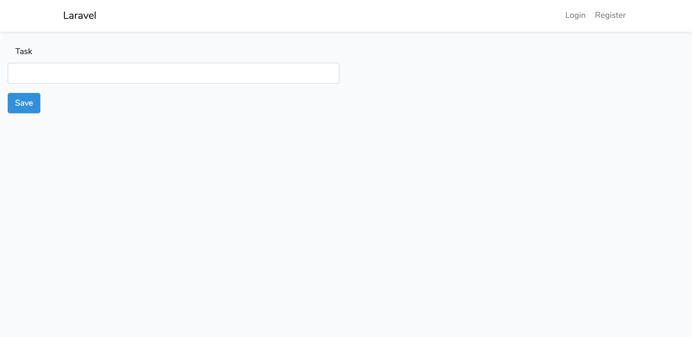


## 6. 登録処理の作成

- 画面自体は作成したので，引き続き入力したタスクを登録する処理を作成する．

### 6.1 登録関数（store）の追記

- 送信画面のフォームは下記のように記述されており，送信先には`route('tasks.store')`が設定されている．これの意味は，「ルーティングのtasks.storeにデータを送信する」となる．

```php
<form action="{{ route('tasks.store') }}" method="POST" class="form-horizontal">
```

- ルーティングではRoute Nameで`tasks.store`が定義されており（4.4項参照），実行される関数は`TasksController.php`の`store()`関数となる．

- というわけで，登録処理に使用する`/project01/app/Http/Controllers/TasksController.php`の`store`関数を以下のように編集する．

```php
public function store(Request $request)
{
  // バリデーション
  $validator = Validator::make($request->all(), [
    'task' => 'required|max:255',
  ]);
  // バリデーション:エラー
  if ($validator->fails()) {
    return redirect()
      ->route('tasks.index')
      ->withInput()
      ->withErrors($validator);
  }
  // Eloquentモデル
  $task = new Task;
  $task->task = $request->task;
  $task->deadline = '2019-10-21';
  $task->comment = 'todo!';
  $task->save();
  // ルーティング「tasks.index」にリクエスト送信（一覧ページに移動）
  return redirect()->route('tasks.index');
}
```

- 記述したら`https://*********.amazonaws.com/tasks`にアクセスし，適当な内容を入力して「save」ボタンをクリックする．うまく行っていればエラーが出ずにページが再読み込みされるので，2-3件登録しておこう．

- 【解説1 / バリデーション】はじめに入力値のチェック（バリデーション）を実行する．formの`name=task`項を必須（`required`）にし，最大長を255に設定している．この条件を満たさない場合は入力画面に戻りエラーメッセージを表示する．

- 【解説2 / dbへの保存】`$task = new Task;`部分でテーブルに紐付いた`Task`モデルを呼び出している．`$task`がtasksテーブルを表現している，と解釈するとイメージが湧きやすい．

- また，formから送信されてきた値は`$request`に配列の形で入ってくる．そのため，`$task->task = $request->task;`部分は「tasksテーブルのtaskカラムにformのname=taskから送信されてきた値を設定する」の意味となる．その後，`$task->save();`の部分で設定した値をテーブルに保存している．

- ※現段階では，タスク名以外は文字列で固定した値をdbに保存している．

### 6.2 登録処理の結果確認

- 実際に送信したデータがdbに登録されているかどうかを確認する．

- 以下のコマンドでmysqlへログインする．

```bash
$ mysql -u root -p
```

- ログインしたらコマンドを順に実行してテーブルの中身を確認する．

```sql
mysql> use project01
mysql> select * from tasks;
```

- 実行結果
```bash
+----+------+------------+---------+---------------------+---------------------+
| id | task | deadline   | comment | created_at          | updated_at          |
+----+------+------------+---------+---------------------+---------------------+
|  1 | hoge | 2020-03-05 | todo!   | 2020-03-05 10:46:16 | 2020-03-05 10:46:16 |
|  2 | fuga | 2020-03-05 | todo!   | 2020-03-05 10:46:34 | 2020-03-05 10:46:34 |
+----+------+------------+---------+---------------------+---------------------+
2 rows in set (0.00 sec)
```

- 上記のようにデータが保存されていればOK．

- 確認したらmysqlからログアウトする．

```sql
mysql> exit;
```


## 7. 表示処理の作成

- dbにデータが保存される状態となったが，画面からは確認ができないので，ブラウザ画面に保存されているデータを表示する処理を作成する．

### 7.1 dbからのデータ取得

- まず，画面表示を行っているコントローラの関数を修正する．

- `/project01/app/Http/Controllers/TasksController.php`の`store()`関数を以下のように編集する．

```php
public function index()
{
  // return view('tasks');
  // 下記のように編集
  $tasks = Task::orderBy('deadline', 'asc')->get();
  return view('tasks', [
    'tasks' => $tasks
  ]);
}
```

- 【解説1 / dbからのデータ取得】`$tasks = Task::orderBy('deadline', 'asc')->get();`部分で`Task`モデルからデータを取得している．`tasks`テーブルに対して`orderBy`で並び順を変更し，`get()`でデータを取得する．

- 【解説2 / ビューへデータを渡す】`return view('tasks')`で`tasks.blade.php`を表示するよう記述されているが，`['tasks' => $tasks]`部分で`$tasks`の値（dbから取得したデータが入っている）を`tasks`という名前で`tasks.blade.php`側へ渡している．ビューへデータを渡すことにより，実際の画面へデータを表示させることができる．表示部分の処理は次項．

- 【補足 / 変数の中身確認】dbから取得したデータなど，変数の中身を確認したい場合は`ddd()`関数を用いると良い．`ddd()`関数が実行されると，引数の値が画面に表示され，処理が中断される．PHPの`var_dump()`→`exit()`の流れと同じ．

  - 似た関数に`dd()`のあるが，`ddd()`のほうが表示される情報が多いのでオススメ．

  - `ddd()`関数の実行例

```php
$tasks = Task::orderBy('deadline', 'asc')->get();
ddd($tasks);  // $tasksの中身を出力
```

### 7.2 dbからのデータ取得

- `/project01/resources/views/tasks.blade.php`に以下の内容を追記する．

- 追記場所は`</form>`の直下．（この下に登録済みタスクリストを表示，のコメント部分）

```php
<!-- 表示領域 -->
@if (count($tasks) > 0)
<div class="panel panel-default">
  <div class="panel-heading">タスクリスト</div>
    <div class="panel-body">
      <table class="table table-striped task-table">
        <!-- テーブルヘッダ -->
        <thead>
          <th>タスク</th>
        </thead>
        <!-- テーブル本体 -->
        <tbody>
          @foreach ($tasks as $task)
          <tr>
            <td class="table-text">
              <div>{{ $task->task }}</div>
            </td>
            <td>
              <!-- 削除ボタン -->
            </td>
          </tr>
          @endforeach
        </tbody>
    </table>
  </div>
</div>
@endif
<!-- ここまでタスクリスト -->
```

- 記述したらブラウザで表示を確認する．`https://*********.amazonaws.com/tasks`にアクセスし，下記のようにデータが表示されればOK．

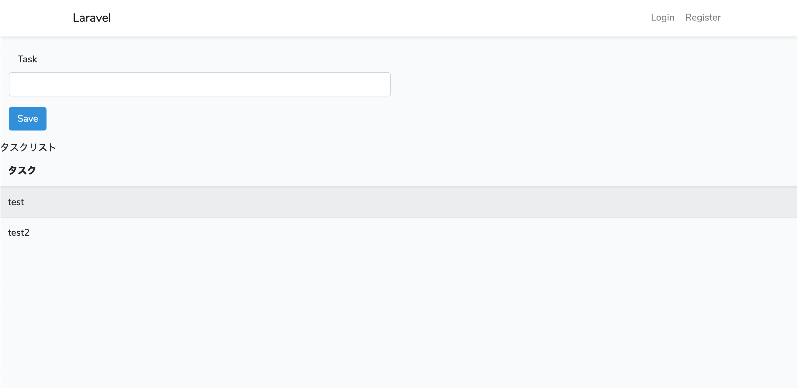

- 【解説】前項でコントローラが渡した`tasks`のデータ（dbから取得したもの）が`$tasks`に入っている．bladeテンプレートでは，変数の内容をもとに条件分岐（`@if`）や繰り返し（`@foreach`）を用いて表示を制御することができる．

- ここでは，`$tasks`にデータが1レコード以上入っている場合のみ（`@if (count($tasks) > 0)`），データを一覧で表示する（`@foreach ($tasks as $task)`）処理を行っている．`$tasks`にdbから取得した全レコードが入っており，`$task`に1レコードずつ入れて表示させている．`$task->task`ではtasksテーブルのカラム名を指定しているイメージ．


## 8. 削除処理の作成

### 8.1 削除ボタンの作成

- 表示画面（`tasks.blade.php`）に削除ボタンを追加する．

- 一覧表示したデータのそれぞれに削除ボタンが表示され，クリックしたらデータが削除されるようにする．

- `/project01/resources/views/tasks.blade.php`に以下の内容を追記する．追記場所は「削除ボタン」コメント部分．

```php
<!-- 削除ボタン -->
<form action="{{ route('tasks.destroy',$task->id) }}" method="POST">
  @method('delete')
  @csrf
  <button type="submit" class="btn btn-danger">削除</button>
</form>
```

- 追記したらブラウザで表示を確認する．`https://*********.amazonaws.com/tasks`にアクセスし，下記のように削除ボタンが表示されればOK．

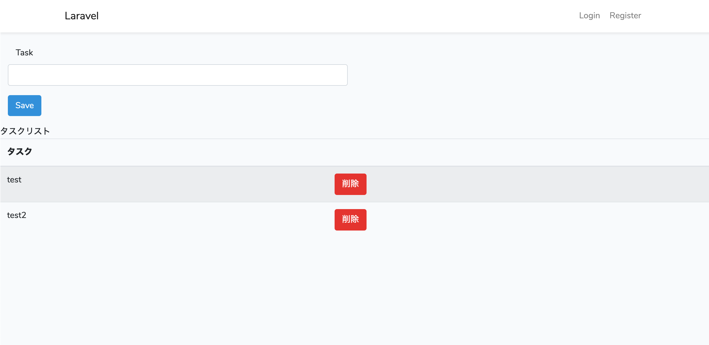

- 【解説1 / データの送信】`route('tasks.destroy',$task->id)`でルーティングの`tasks.destroy`にテーブルの各レコードidの値を送信している．idを指定することで，どのレコードを削除するのかを指定する．

- 【解説2 / `@method('delete')`】ルーティングの部分（4.4項）で削除の部分は`DELETE`メソッドで定義しているが，`form`からの送信では`GET`と`POST`の2つしか扱えない．そのため，`form`内に`@method('delete')`を記述して`DELETE`メソッドを使用できるようにしている．

### 8.2 dbから削除する処理の作成

- 前項でビューファイルから削除するレコードのidを送信した．引き続き，送信先の`tasks.destroy`に紐付いた`destroy`関数の内容を記述する．

- `/project01/app/Http/Controllers/TasksController.php`の`destroy()`関数を以下のように編集する．

```php
public function destroy($id)
{
  $task = Task::find($id);
  $task->delete();
  return redirect()->route('tasks.index');
}
```

- 【解説】ビューファイルから送信されたidが`$id`に入る．`find()`関数にidの値を渡すことで，該当する1レコードを指定している．その後，`delete()`関数でレコードの削除する処理を実行．

- 削除の処理が完了したら，`redirect()`関数で一覧画面へ移動している．


## 9. 入力フォームと一覧表示の項目追加

- 登録処理の実装時，タスク名以外は固定した文字列をdbに保存していた．

- ここでは，タスク名以外の入力欄を追加して締切とコメントも入力したものがdbに保存されるよう記述を変更する．

### 9.1 入力フォームの追加

- タスク名のみのフォームに，「締め切り」「コメント」の2つを追加する．

- `/project01/resources/views/tasks.blade.php`を以下のように編集する．

```php
@extends('layouts.app')
@section('content')
<div class="panel-body">
  <!-- バリデーションエラーの表示に使用するエラーファイル-->
  @include('common.errors')
  <!-- タスク登録フォーム -->
  <form action="{{ route('tasks.store') }}" method="POST" class="form-horizontal">
    @csrf
    <div class="form-group">
      <!-- タスク名 -->
      <div class="col-sm-6">
        <label for="task" class="col-sm-3 control-label">Task</label>
        <input type="text" name="task" id="task" class="form-control">
      </div>
      // ここから追記
      <!-- deadline -->
      <div class="col-sm-6">
        <label for="deadline" class="col-sm-3 control-label">Deadline</label>
        <input type="date" name="deadline" id="deadline" class="form-control">
      </div>
      <!-- comment -->
      <div class="col-sm-6">
        <label for="comment" class="col-sm-3 control-label">Comment</label>
        <input type="text" name="comment" id="comment" class="form-control">
      </div>
      // ここまで追記
    </div>
    <!-- タスク登録ボタン -->
    <div class="form-group">
      <div class="col-sm-offset-3 col-sm-6">
        <button type="submit" class="btn btn-primary">Save</button>
      </div>
    </div>
  </form>
  ...
```

- 追記したらブラウザで表示を確認する．`https://*********.amazonaws.com/tasks`にアクセスし，下記のように入力欄が3つ表示されればOK．

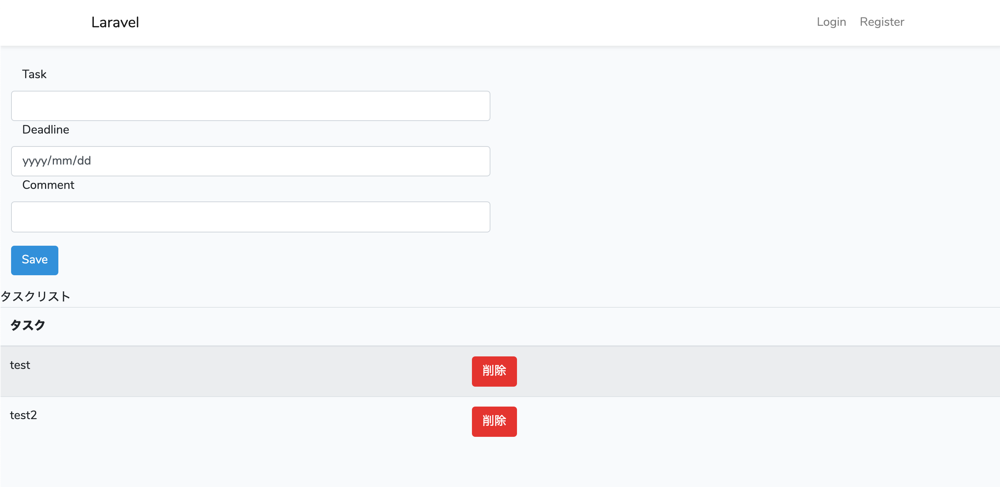

### 9.2 登録処理の編集

- 入力欄を3つにしたので，それぞれ入力した項目が登録に反映されるようにコントローラの関数を編集する．

- `/project01/app/Http/Controllers/TasksController.php`の`store()`関数を以下のように編集する．

```php
public function store(Request $request)
{
  //バリデーション
  $validator = Validator::make($request->all(), [
    'task' => 'required|max:255',
    // 下記を追記
    'deadline' => 'required',
  ]);
  //バリデーション:エラー
  if ($validator->fails()) {
    return redirect()
      ->route('tasks.index')
      ->withInput()
      ->withErrors($validator);
  }
  // Eloquentモデル
  $task = new Task;
  $task->task = $request->task;
  // 下記のように編集
  $task->deadline = $request->deadline;
  $task->comment = $request->comment;
  // ここまで編集
  $task->save();
  //「/」ルートにリダイレクト
  return redirect()->route('tasks.index');
}
```

- それぞれ入力し，saveして入力した内容が保存されていればOK．

### 9.3 一覧表示の追加

- 現在タスク名のみ表示されている一覧表示部分に，「締め切り」「コメント」を追加する．

- `/project01/resources/views/tasks.blade.php`を以下のように編集する．

```php
...
@if (count($tasks) > 0)
<div class="panel panel-default">
  <div class="panel-heading">タスクリスト</div>
    <div class="panel-body">
      <table class="table table-striped task-table">
        <!-- テーブルヘッダ -->
        <thead>
          <th>タスク</th>
          // ここから追記
          <th>締め切り</th>
          <th>コメント</th>
          // ここまで追記
        </thead>
        <!-- テーブル本体 -->
        <tbody>
          @foreach ($tasks as $task)
          <tr>
            <td class="table-text">
              <div>{{ $task->task }}</div>
            </td>
            // ここから追記
            <td class="table-text">
              <div>{{ $task->deadline }}</div>
            </td>
            <td class="table-text">
              <div>{{ $task->comment }}</div>
            </td>
            // ここまで追記
            <td>
              <!-- 削除ボタン -->
              <form action="{{ route('tasks.destroy',$task->id) }}" method="POST">
                @method('delete')
                @csrf
                <button type="submit" class="btn btn-danger">削除</button>
              </form>
            </td>
          </tr>
          @endforeach
        </tbody>
    </table>
  </div>
</div>
@endif
<!-- ここまでタスクリスト -->
...
```

- 追記したらブラウザで表示を確認する．`https://*********.amazonaws.com/tasks`にアクセスし，下記のように入力項目が追加されていればOK．

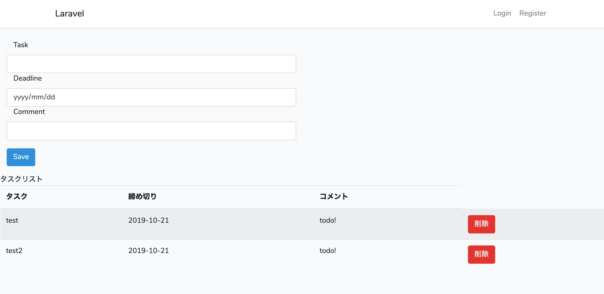


## 10. 更新処理の作成

- 更新処理の必要なのは以下の要素．

  - 更新ボタンをクリック
  - 更新ページへ移動
  - 更新ページで既存の情報を編集し，dbへ送信
  - dbのデータを書き換え→一覧ページに戻る

### 10.1 更新ボタンの追加

- 一覧画面に更新ボタンを追加する．`/project01/resources/views/tasks.blade.php`に以下を追記する．追記場所は削除ボタンの直上．

```php
<!-- 更新ボタン追加 -->
<td>
  <form action="{{ route('tasks.edit',$task->id) }}" method="GET">
    @csrf
    <button type="submit" class="btn btn-primary">更新</button>
  </form>
</td>
<!-- 追加ここまで -->
<td>
  <!-- 削除ボタン -->
  <form action="{{ route('tasks.destroy',$task->id) }}" method="POST">
    @method('delete')
    @csrf
    <button type="submit" class="btn btn-danger">削除</button>
  </form>
</td>
```

- 追記したらブラウザで表示を確認する．`https://*********.amazonaws.com/tasks`にアクセスし，下記のように更新ボタンが追加されていればOK．

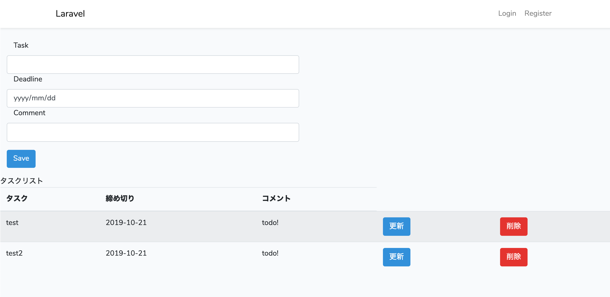


### 10.2 更新ページへ移動する処理の作成

- 更新ボタンをクリックした際に，更新ページへ移動する処理を作成する．

- 更新ボタンは下記のようになっており，クリック時に`tasks.edit`へリクエストが送られる．削除ボタンと同様に，リクエスト送信時にレコードのid値が送信される．

```php
<form action="{{ route('tasks.edit',$task->id) }}" method="GET">
```

- ルーティングではコントローラの`edit`関数が実行されるよう記述されているため，`/project01/app/Http/Controllers/TasksController.php`の`edit()`関数を以下のように編集する．

```php
public function edit($id)
{
  $task = Task::find($id);
  return view('taskedit', ['task' => $task]);
}
```

- 現時点では画面を作成していないため，更新ボタンをクリックしてもうまく処理が実行されない．

- `$task = Task::find($id);`のあとに`ddd()`関数を実行して中身をチェックしてみても良いでしょう．

- 【解説】`edit()`関数にidが送信されると，テーブルから該当するidのレコードが取得され，`taskedit.blade.php`を表示する．`taskedit.blade.php`には，該当するレコードの内容が`task`という名前で渡されている．

### 10.3 更新ページの作成

- 前項で更新ページを表示する処理を作成したので，更新ページ自体を作成する．

- まず，`/project01/resources/views`に`taskedit.blade.php`を新規作成する．

- 作成した`taskedit.blade.php`には，以下の内容を記述する．

```php
@extends('layouts.app')
@section('content')
<div class="panel-body">
  <div class="col-sm-6">
    @include('common.errors')
    <form action="{{ route('tasks.update',$task->id) }}" method="POST"  class="form-horizontal">
      @method('PUT')
      @csrf
      <!-- task -->
      <div class="form-group">
        <label for="task">Task</label>
        <input type="text" id="task" name="task" class="form-control" value="{{$task->task}}">
      </div>
      <!-- deadline -->
      <div class="form-group">
        <label for="deadline">Deadline</label>
        <input type="date" id="deadline" name="deadline" class="form-control" value="{{$task->deadline}}">
      </div>
      <!-- comment -->
      <div class="form-group">
        <label for="comment">Comment</label>
        <input type="text" id="comment" name="comment" class="form-control" value="{{$task->comment}}">
      </div>
      <!-- Saveボタン/Backボタン -->
      <div class="well well-sm">
        <button type="submit" class="btn btn-primary">Save</button>
        <a class="btn btn-link pull-right" href="{{ route('tasks.index') }}">Back</a>
      </div>
    </form>
  </div>
</div>
@endsection
```

- 追記したらブラウザで表示を確認する．`https://*********.amazonaws.com/tasks`にアクセスし，更新ボタンをクリック．input部分に選択したデータが表示されていればOK．

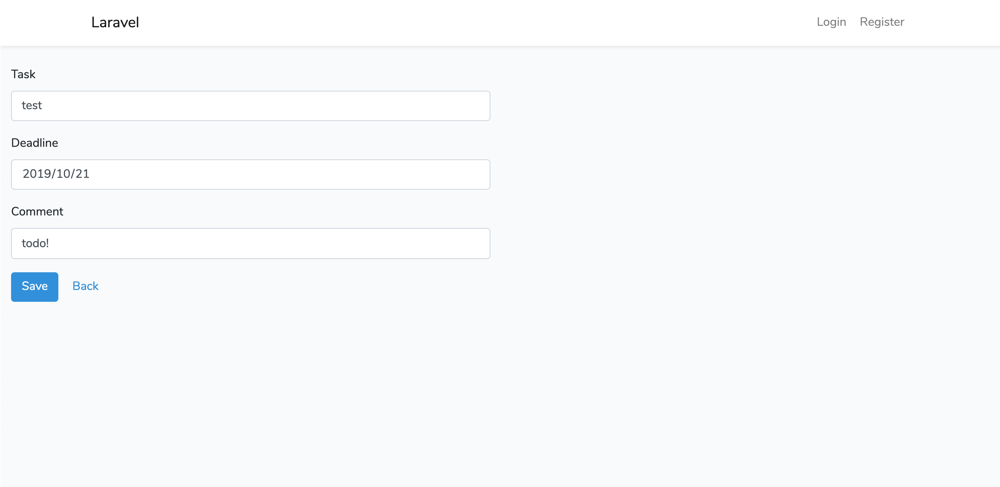

- 【解説1 / データの表示】前項の`edit()`関数で取得したデータが`$task`に入っている．`$task`の中身を各input要素の`value`に展開している．

- 【解説2 / データの送信】input要素で編集した値は，saveボタンクリック時に`route('tasks.update',$task->id)`に送信される．ルーティングでは，`tasks.update`へのリクエスト時にコントローラの`update()`が実行されるよう定義されているので，次項で処理を追記する．

### 10.4 dbのデータを更新する処理の作成

- `taskedit.blade.php`からのリクエストを処理するルーティングではコントローラの`update`関数が実行されるよう記述されているため，`/project01/app/Http/Controllers/TasksController.php`の`update()`関数を以下のように編集する．

```php
public function update(Request $request, $id)
{
  //バリデーション
  $validator = Validator::make($request->all(), [
    'task' => 'required|max:255',
    'deadline' => 'required',
  ]);
  //バリデーション:エラー
  if ($validator->fails()) {
    return redirect()
      ->route('tasks.edit', $id)
      ->withInput()
      ->withErrors($validator);
  }
  //データ更新処理
  $task = Task::find($id);
  $task->task   = $request->task;
  $task->deadline = $request->deadline;
  $task->comment = $request->comment;
  $task->save();
  return redirect()->route('tasks.index');
}
```

- 記述したら動作を確認する．`taskedit.php`の画面から適当に値を編集し，saveボタンをクリックする．一覧画面に移動して，データが更新されていればOK．

- 【解説】処理の流れは登録の処理に酷似している．`$task = Task::find($id);`部分でidを指定しているため，該当するレコードが更新される．一方，登録処理のようにidを指定せずに実行するとデータが新しく作成される．


## 11. 認証処理の作成

- laravelでは，webサービスでよく使用される認証の処理を手軽に実装することができる．

- ライブラリ追加時にユーザー登録画面・ログイン画面などは自動で作成されているが，現状これらの機能はアプリケーションに反映されていない．

- 以下の流れでアプリケーションに認証機能を追加する．

  - 認証関連ページの確認．
  - ログイン時に，自動的に一覧画面が表示されるようにする．
  - 未認証時にアプリケーションの機能にアクセスできないようにする．
  - データ登録時に，ユーザidを一緒に登録するよう処理を変更する．
  - データ一覧表示の際に，ログインユーザが登録したデータのみ表示されるよう処理を変更する．

### 11.1 認証関連ページの確認

- まず認証関連のページを確認する．`https://*********.amazonaws.com/home`にアクセスし，下記画面が表示されていればOK．

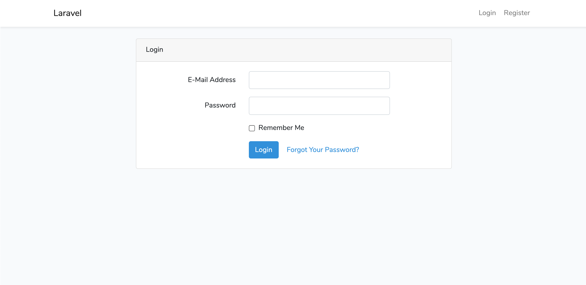

- ※実際に表示されている画面は`login.blade.php`となる．ログインしていない場合はログイン画面に移動するよう設定されているため．

- 右上の「Register」をクリックすると，下記登録画面が表示されるので，適当な値を入力してユーザ登録をしておこう．

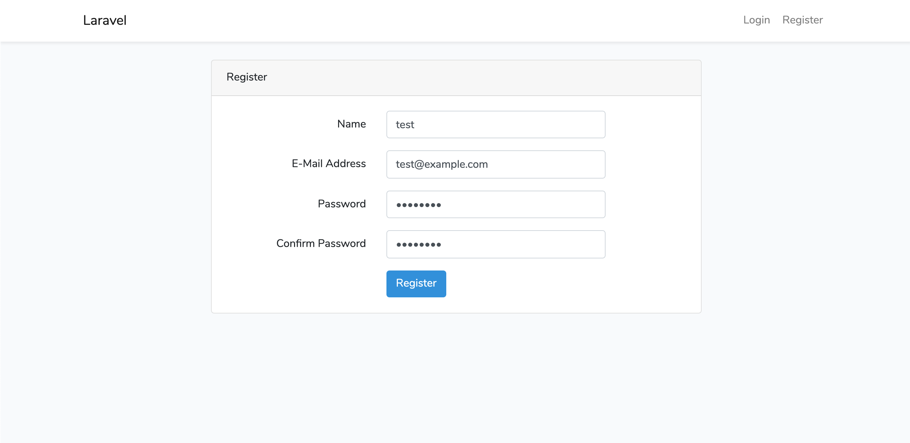

### 11.2 ログイン時の表示ページを変更

- 登録すると，`You are logged in!`と表示された画面（`home.blade.php`）に移動する．しかし，認証完了時にはタスク一覧画面を表示させたい．上記画面を表示するよう設定しているのは`web.php`なので，下記のように編集する．編集する部分は最下部．

```php
Auth::routes();

// ここを下記のように編集
// Route::get('/home', 'HomeController@index')->name('home');
Route::get('/home', 'TasksController@index')->name('home');
```

- 一度ログアウト→再度ログインし，一覧画面が表示されればOK．

### 11.3 未認証時に機能を制限する

- 現時点では，ログインしていない状態で`https://*********.amazonaws.com/home`にアクセスすると一覧が表示されてしまう．

- 認証していない状態では，アプリケーションの機能を実行せず，ログイン画面へ移動するように処理を変更する．

- `/project01/app/Http/Controllers/TasksController.php`の`index()`関数のすぐ上に以下を追記する．

```php
public function __construct()
{
  $this->middleware('auth');
}
```

- 追記したらブラウザで表示を確認する．ログインしていない状態で`https://*********.amazonaws.com/tasks`にアクセスし，ログインページに移動すればOK．

- 【解説1 / `__construct()`】`__construct()`という名前の関数を定義すると，コントローラ内の何れかの関数が実行される場合，該当する関数の前に`__construct()`関数が実行されるようになる．

  - 例：`index()`関数が実行される場合，`__construct()`→`index()`の順に処理が実行される．

- 【解説2 / `$this->middleware('auth');`】ログイン状態でない場合はログイン画面に自動で移動する処理．最初から用意されている．

### 11.4 1ユーザ1サービス

- ここまでで認証ユーザのみが使用できるアプリケーションが実装できた．

- しかし，この状態では誰がログインしても全ユーザのデータが表示されてしまう．

- そのため，テーブルのカラムに`user_id`を追加してデータの登録時にログインユーザのidをあわせて登録し，どのユーザが登録したデータなのかを区別できるように処理を変更する．

- テーブルの構造を変更するので，マイグレーションファイルを以下のように修正する．

```php
public function up()
{
  Schema::create('tasks', function (Blueprint $table) {
    $table->id();
    // user_idカラムを作成するよう追記
    $table->integer('user_id');
    // 以降変更なし
    $table->string('task');
    $table->date('deadline');
    $table->text('comment')->nullable();
    $table->timestamps();
  });
}
```

- 記述したら下記コマンドを実行し，テーブルを再構成する．保存されているデータは削除されるため注意．

```bash
$ php artisan migrate:fresh
```

- 実行結果．

```bash
Dropped all tables successfully.
Migration table created successfully.
Migrating: 2014_10_12_000000_create_users_table
Migrated:  2014_10_12_000000_create_users_table (0.05 seconds)
Migrating: 2014_10_12_100000_create_password_resets_table
Migrated:  2014_10_12_100000_create_password_resets_table (0.04 seconds)
Migrating: 2019_08_19_000000_create_failed_jobs_table
Migrated:  2019_08_19_000000_create_failed_jobs_table (0.02 seconds)
Migrating: 2020_06_23_024905_create_tasks_table
Migrated:  2020_06_23_024905_create_tasks_table (0.02 seconds)
```

- mysqlにログインし，テーブルの構造を確認する．

```bash
$ mysql -u root -p
```

```sql
mysql> use project01;
mysql> desc tasks;
```

- 実行結果．
```bash
+------------+---------------------+------+-----+---------+----------------+
| Field      | Type                | Null | Key | Default | Extra          |
+------------+---------------------+------+-----+---------+----------------+
| id         | bigint(20) unsigned | NO   | PRI | NULL    | auto_increment |
| user_id    | int(11)             | NO   |     | NULL    |                |
| task       | varchar(255)        | NO   |     | NULL    |                |
| deadline   | date                | NO   |     | NULL    |                |
| comment    | text                | YES  |     | NULL    |                |
| created_at | timestamp           | YES  |     | NULL    |                |
| updated_at | timestamp           | YES  |     | NULL    |                |
+------------+---------------------+------+-----+---------+----------------+
7 rows in set (0.00 sec)
```

- `user_id`カラムが設定されていればOK．

- 確認したらmysqlからログアウト．

```sql
mysql> exit;
```

- 続いて，データ登録時に`user_id`カラムにログインユーザのidを登録するよう処理を変更する．

- 登録処理は`store()`関数で実行しているため，`/project01/app/Http/Controllers/TasksController.php`の`store()`関数に以下を追記する．

```php
public function store(Request $request)
{
  //バリデーション
  $validator = Validator::make($request->all(), [
    'task' => 'required|max:255',
    'deadline' => 'required',
  ]);
  //バリデーション:エラー
  if ($validator->fails()) {
    return redirect()
      ->route('task.index')
      ->withInput()
      ->withErrors($validator);
  }
  // Eloquentモデル
  $task = new Task;
  // 下記1行を追加
  $task->user_id = Auth::user()->id;
  // 以降変更なし
  $task->task = $request->task;
  $task->deadline = $request->deadline;
  $task->comment = $request->comment;
  $task->save();
  //「/」ルートにリダイレクト
  return redirect()->route('tasks.index');
}
```

- また，`Auth`クラスを使用するため，`/project01/app/Http/Controllers/TasksController.php`のはじめに以下を追記する．

```php
<?php

namespace App\Http\Controllers;

use Illuminate\Http\Request;
use Validator;
use App\Task;
// 下記1行を追記
use Auth;
...
```

- これで登録時の実装は完了．

- 一方，一覧画面でもログインユーザの登録したデータのみ表示されるようにしたい．

- dbからのデータ取得時に`user_id`の値でフィルタリングするよう，`/project01/app/Http/Controllers/TasksController.php`の`index()`関数の処理を変更する．

```php
public function index()
{
  // $tasks = Task::orderBy('deadline', 'asc')->get();
  // 下記のように変更
  $tasks = Task::where('user_id',Auth::user()->id)
          ->orderBy('deadline', 'asc')
          ->get();
  // 以降は変更なし
  return view('tasks', [
    'tasks' => $tasks
  ]);
}
```

- 記述したら，複数のユーザでログインし，それぞれのユーザが登録したデータのみ表示される状態になっていればOK.

- ここまでで，認証機能つきのtodoリストアプリケーションが完成した．はじめから処理の流れを理解することが難しいが，何度も繰り返しアプリケーションを実装することでデータの流れの理解が進んでくる．10回くらい繰り返し実装すれば十分だろう．

以上である( `･ω･)b

